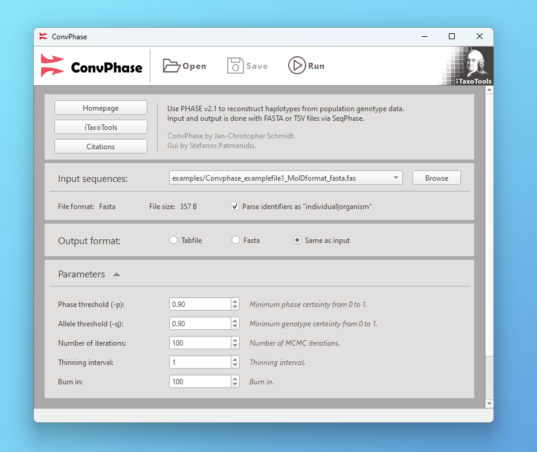

# ConvPhaseGui

Reconstruct haplotypes from sequence data. Input and output can be in TSV or FASTA format.

This is a Qt GUI for [ConvPhase](https://github.com/iTaxoTools/ConvPhase), a convenient phase program that combines [PHASE](https://github.com/stephens999/phase) and [SeqPHASE](https://github.com/eeg-ebe/SeqPHASE).



## Windows and macOS Executables

Download and run the standalone executables without installing Python.</br>
[See the latest release here.](https://github.com/iTaxoTools/ConvPhaseGui/releases/latest)

## Usage

For information on how to use the program, please refer to the 1st section of the [Hapsolutely manual](https://itaxotools.org/Hapsolutely_manual_07Nov2023.pdf).

## Installing from source

Clone and install the latest version (requires Python 3.10.2 or later):

```
git clone https://github.com/iTaxoTools/ConvPhaseGui.git
cd ConvPhaseGui
pip install . -f packages.html
convphase-gui
```

If you are also compiling *ConvPhase*, you will need all of its [dependencies](https://github.com/iTaxoTools/ConvPhase#dependencies).


### Packaging

It is recommended to use PyInstaller from within a virtual environment:
```
pip install ".[dev]" -f packages.html
pyinstaller scripts/convphase.spec
```

## Citations

*ConvPhaseGui* was developed in the framework of the *iTaxoTools* project:

*Vences M. et al. (2021): iTaxoTools 0.1: Kickstarting a specimen-based software toolkit for taxonomists. - Megataxa 6: 77-92.*

Sequences are phased using *PHASE* and *SeqPHASE*:

*Stephens, M., Smith, N., and Donnelly, P. (2001). A new statistical method for haplotype reconstruction from population data. American Journal of Human Genetics, 68, 978--989.*

*Stephens, M., and Donnelly, P. (2003). A comparison of Bayesian methods for haplotype reconstruction from population genotype data. American Journal of Human Genetics, 73:1162-1169.*

*Flot, J.F. (2010) seqphase: a web tool for interconverting phase input/output files and fasta sequence alignments. Mol. Ecol. Resour., 10, 162–166.*
